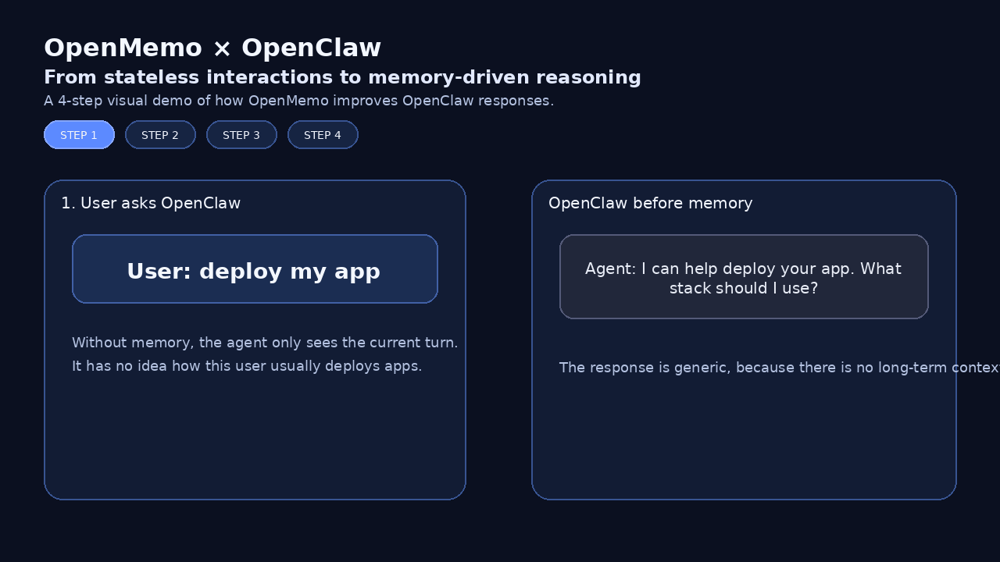
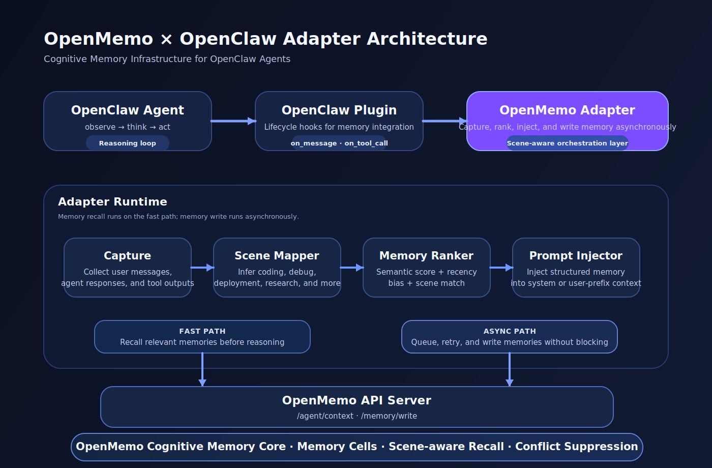

# OpenMemo × OpenClaw Adapter

**Cognitive Memory Infrastructure for OpenClaw Agents**

OpenMemo turns OpenClaw from a stateless agent into a memory-driven collaborator.

Instead of storing raw conversation logs, OpenMemo builds structured cognitive memories that agents can recall intelligently during reasoning.

⭐ If you find this useful, please give the repo a star.

---

## Overview

OpenClaw ships with basic memory mechanisms such as:

- `session.jsonl`
- `memory.md`
- `soul.md`

These are useful for storing conversation history, but they are not designed for long-term cognitive memory.

Typical limitations:

- Session logs grow indefinitely
- Context compression causes information loss
- Markdown memory is unstructured
- Retrieval lacks task awareness

**OpenMemo solves this by introducing cognitive memory infrastructure for agents.**

Instead of storing conversations, OpenMemo creates structured memory cells about user behavior, workflows, and decisions.



---

## Why OpenMemo?

Most agent memory systems store chat history.

**OpenMemo stores cognitive memory.**



Agents remember:

- User preferences
- Successful workflows
- Deployment habits
- Debugging strategies
- Decision patterns

This enables agents to behave like persistent collaborators, not stateless chatbots.

---

## Architecture

OpenMemo integrates with OpenClaw through a lightweight adapter layer.

```
OpenClaw Agent
│
▼
OpenClaw Plugin (Lifecycle Hooks)
│
▼
OpenMemo Adapter
│
├── Memory Recall
└── Async Memory Write
│
▼
OpenMemo API Server
│
▼
OpenMemo Cognitive Memory Core
```

| Component | Role |
|-----------|------|
| OpenClaw Plugin | Hooks agent lifecycle |
| Adapter | Memory orchestration |
| OpenMemo API | Memory access interface |
| Memory Core | Cognitive memory engine |

---

## Memory Flow

During each OpenClaw reasoning cycle:

**1️⃣ Lifecycle events**

- `on_user_message`
- `on_agent_response`
- `on_tool_call`
- `on_task_complete`

**2️⃣ Recall relevant memories**

```
POST /agent/context
```

**3️⃣ Inject memory into the prompt**

```
Relevant memory:
1. User prefers Python backend
2. User deploys applications using Docker
```

**4️⃣ Store new memories asynchronously**

```
POST /memory/write
```

Memory writes never block the agent loop.

---

## Key Features

### Scene-Aware Memory

Memories are tagged with scenes:

- `coding`
- `debug`
- `deployment`
- `research`
- `web_search`

When recalling memory, the adapter matches `query + scene`.

Example:

```
query: deploy application
scene: deployment
→ Only deployment-related memories are returned.
```

### Intelligent Memory Ranking

OpenMemo ranks memories using multiple signals:

```
semantic relevance
+ recency bias
+ scene matching
```

This avoids returning outdated memories.

### Conflict Suppression

Outdated preferences won't override current instructions.

Example:

```
History memory:     User prefers Python
Current instruction: Use Go
→ OpenMemo suppresses the conflicting memory.
```

### Structured Cognitive Memory

Instead of storing conversations:

```
User: deploy my app
Agent: using docker
```

OpenMemo extracts memory cells:

```
User deploys applications using Docker
User prefers Python backend
User uses pytest for debugging
```

These are far more useful for reasoning.

---

## How OpenMemo Differs From Other Memory Systems

| Feature | OpenClaw Default | Typical Memory Plugin | OpenMemo |
|---------|-----------------|----------------------|----------|
| Storage | JSONL / Markdown | Vector DB | Cognitive memory cells |
| Retrieval | None | Semantic search | Scene-aware recall |
| Ranking | None | Vector similarity | Semantic + recency + scene |
| Conflict handling | No | Rare | Built-in suppression |
| Memory structure | Unstructured logs | Flat facts | Contextual memories |
| Agent awareness | No | Limited | Scene-aware |

---

## Installation

Install the adapter:

```bash
pip install openmemo-openclaw
```

Install OpenMemo if needed:

```bash
pip install openmemo
```

---

## Quick Start

**Start the OpenMemo memory server:**

```bash
openmemo serve --port 8765
```

**Configure OpenClaw:**

```yaml
memory:
  backend: openmemo
  endpoint: http://localhost:8765
```

**Run OpenClaw normally:**

```bash
openclaw run
```

Your agent now uses OpenMemo as its memory backend.

---

## 3-Minute Demo

Try OpenMemo with OpenClaw in under 3 minutes.

**1. Install**

```bash
pip install openmemo
pip install openmemo-openclaw
```

**2. Start memory server**

```bash
openmemo serve
```

**3. Run OpenClaw**

```bash
openclaw run
```

**4. Interact with the agent**

```
User: deploy my app
```

Later:

```
User: how should I deploy my backend?
```

OpenMemo recall:

```
Relevant memory:
1. User deploys applications using Docker
2. User prefers Python backend
```

Agent:

```
I'll deploy your Python backend using Docker.
```

---

## Cold Start Handling

When OpenMemo memory is empty (first install):

```
memory_context == []
```

The adapter skips memory injection to avoid prompt noise.

---

## Async Memory Write

Memory writes are processed asynchronously.

```
event → async queue → memory worker → OpenMemo API
```

Retry strategy:

```
max_retry = 3
backoff = exponential

retry1 → 0.5s
retry2 → 1.0s
retry3 → 2.0s
```

---

## Configuration

Example configuration:

```yaml
memory:
  backend: openmemo
  endpoint: http://localhost:8765

  injection_strategy: system    # system | user_prefix
  conflict_policy: suppress

  max_injected_items: 3
```

---

## Developer Mode

You can observe memory behavior in logs.

```
[openmemo] scene=deployment
[openmemo] recall hits=2
[openmemo] injecting memory
[openmemo] queued memory write
```

This helps developers understand how memory influences agent reasoning.

---

## Roadmap

| Version | Features |
|---------|----------|
| v2 | Multi-agent memory, shared memory pools |
| v3 | Team knowledge bases, memory synchronization |
| v4 | Memory governance, policy-based memory control |

---

## License

Apache 2.0

---

**Built with [OpenMemo](https://github.com/openmemoai/openmemo) Cognitive Memory Engine.**
